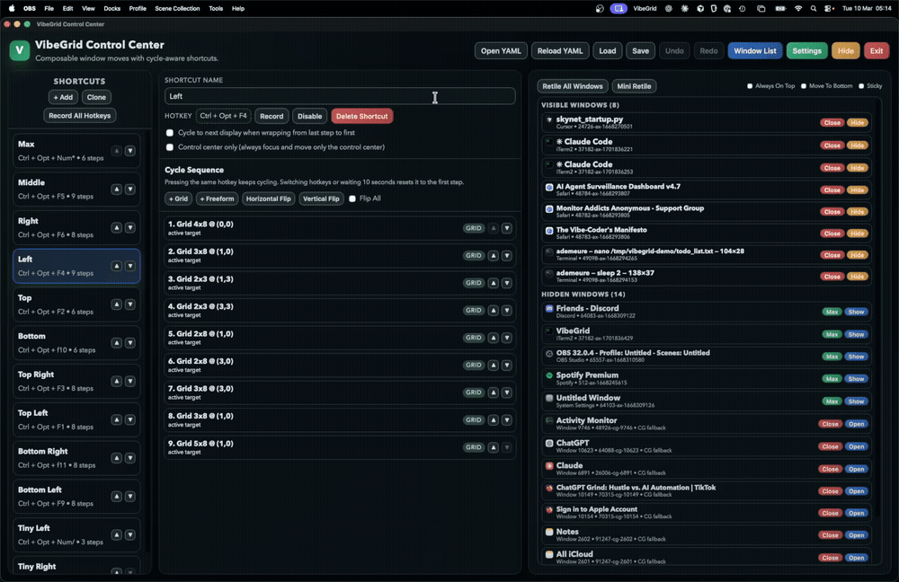
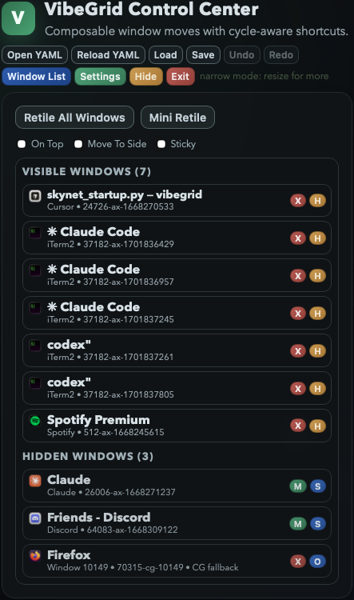
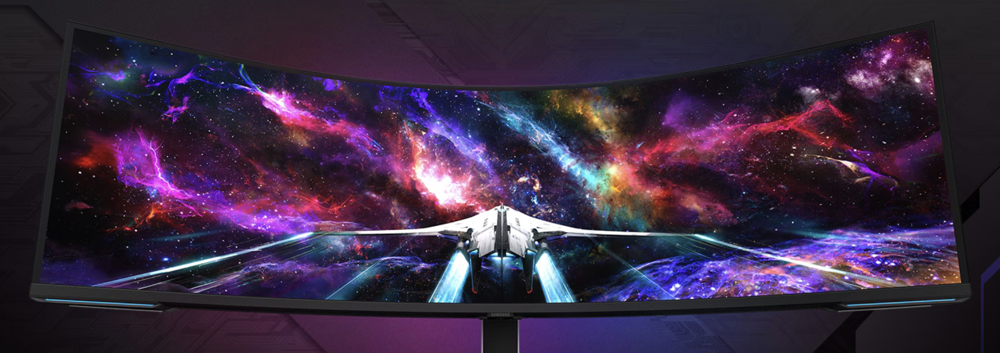
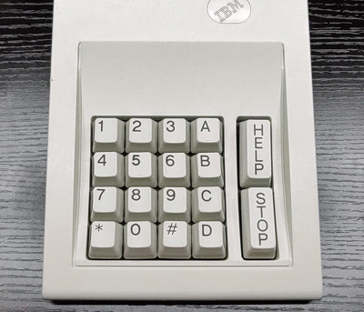
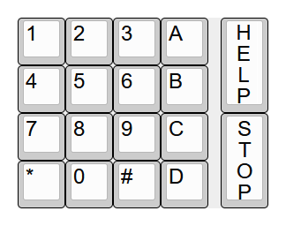

# VibeGrid

> Hardcore Window Management For Ultrawide & Many-Monitor Setups (macOS + Windows)

<table>
<tr>
<td width="50%"><b>Grid Layouts</b><br></td>
<td width="50%"><b>Tiling & Movement</b><br></td>
</tr>
</table>

The year is 2027. The Parallel Agent Wars have begun, and the average vibe-coder uses more than 7 Samsung Odyssey 57" 8K monitors and 12 microphones in a desperate attempt to keep up with Peter Steinberger's productivity and feel like they're adding value to their legions of fully autonomous coding agents (they're not).

But sadly, Window Layout Management software hasn't managed to keep up in this timeline. Human brains have atrophied to the point where they don't even remember how to use more than one window at a time. This had terrible safety implications: horrific neck pain for humans, and misaligned agents hiding in plain sight behind fullscreen windows of Microsoft Notepad for AI (Copilot++ Edition).  

VibeGrid may be our only chance to avoid that horrible future.

## Features Summary

- `24/7 Live Window List`: visually highlight and control windows from every application with the Window List.
- `Advanced Hotkeys`: cycle-aware shortcuts for grid and freeform layouts (fixed sequence per hotkey).
- `Hover Move`: move windows by selecting them in the window list, or move any focused window.
- `Display++`: target current display, specific display, or cycle automatically.
- `Visual UI`: draw beautiful grids instead of hardcoding ugly rectangles.
- `YAML-first`: great for agents & humans alike, easy to switch & share.
- `Local-first`: no account, no cloud sync, no fake desktop app story.

<br/>

<p align="center">
  <br/>
  <br/>
     
</p>

> Here's [my current config](docs/vibegrid-57inch.yaml) for my 57" Samsung G95NC Odyssey monitor if you're curious! <br/>
> Optimized for left-handed [Razer MMORPG Mouses](https://www.razer.com/gb-en/gaming-mice/razer-naga-left-handed-edition) and/or [IBM SRK Keypads](https://sharktastica.co.uk/wiki/model-m-srk) from 1988. <br/>
> Probably works on regular keyboards but I haven't tried tbh.

## AI Safety Disclaimer

VibeGrid is my humble contribution to the field of AI Observability, helping you observe windows where you run AI.

For added safety, always ask Claude Code for a full security review with '--allow-dangerously-skip-permissions'.

I deny all responsibility if you don't (and I deny even more responsibility if you do).

## Setup Instructions

Download unsigned binaries from [GitHub Releases](https://github.com/ademeure/vibegrid/releases/latest) (or just build it yourself below).

### macOS — UI via System Settings

1. Download and unzip `VibeGrid-macOS.zip`.
2. Move `VibeGrid.app` to `Applications`.
3. Double-click `VibeGrid.app` to open it.
4. If macOS shows *"Apple could not verify..."*:
    - Open **System Settings > Privacy & Security**.
    - Scroll down and click **Open Anyway** next to the VibeGrid message.
    - Open the app again.

VibeGrid needs Accessibility access. If macOS doesn't prompt you, click 'Permissions' near the top of the window.

When running in the background, you can find VibeGrid in the macOS Control Center (top right of your screen).

### macOS — Terminal (fewer clicks)

```bash
cd ~/Downloads
unzip VibeGrid-macOS.zip
sudo xattr -dr com.apple.quarantine VibeGrid.app
mv VibeGrid.app /Applications/
open /Applications/VibeGrid.app
```

The `xattr` command clears the Gatekeeper quarantine flag so macOS won't block the unsigned app.

### Windows 11

1. Download and double-click `VibeGrid-Windows11.exe`.
2. VibeGrid automatically opens the control center in your browser.
3. You can reopen the control center and/or close the server with the tray icon.

No extra files are required beside the `.exe` (feel free to move it anywhere you like). 

### Config

- macOS: `~/Library/Application Support/VibeGrid/config.yaml`
- Windows: `%APPDATA%\VibeGrid\config.yaml`

## Local Build

macOS dev:

```bash
make dev
```

macOS app:

```bash
./scripts/build_app.sh
open dist/VibeGrid.app
```

Windows exe:

```bash
make windows-exe
dist\windows\VibeGrid-Windows11.exe
```

## Notes

- macOS is the primary native platform.
- Windows is ~feature-complete and uses the same UI and YAML model.
- Public macOS distribution without the Gatekeeper warning requires Apple Developer ID signing and notarization. Unfortunately, Opus 4.6 and Codex 5.3 cannot legally do this in their own name, and it would feel wrong for me to steal their credit when I have absolutely no idea how any of this code works(*)

(*): okay that's a lie... I'm very embarrassed to admit this publicly, but I actually looked at the code sometimes... :(
